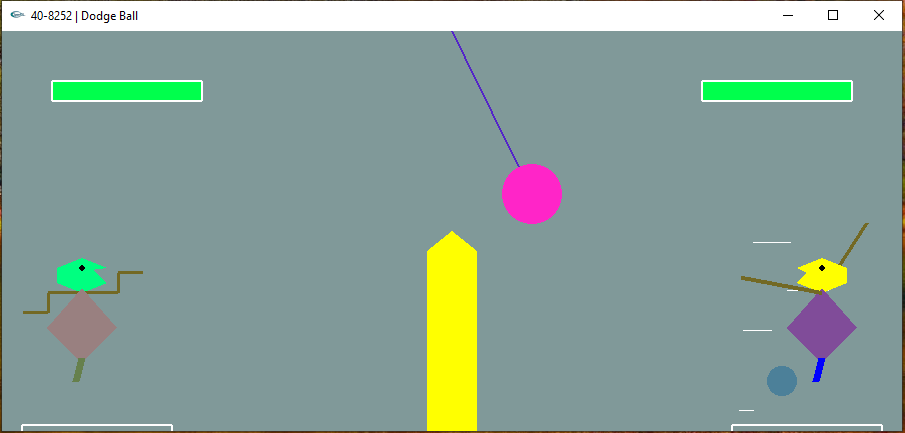
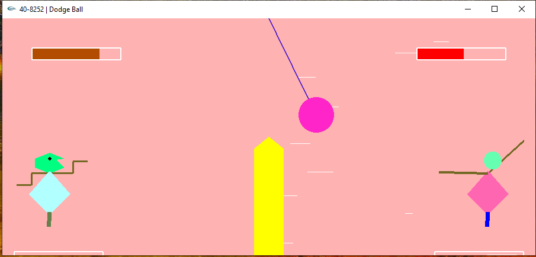
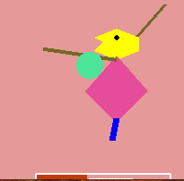

<h1> Dodge Ball </h1>

    simple c++ graphics project, yet so entertaining to play.
    Challenge your friends!

> What's implemented?

- Animated characters/background
- Gradient colours (health/power bars)
- Collisions
- Obstacles
- audio (for windows)

> Screenshots

 

 

 

